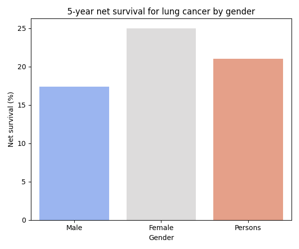

# Lung Cancer Survival Analysis (2016–2020)

📊 **5-Year Net Survival for Lung Cancer by Gender**

---

## 🧠 Objective

To explore whether 5-year net survival rates for lung cancer differ by gender using publicly available cancer survival data from NHS England (2016–2020).

The aim of this project was to identify potential disparities and communicate insights that could support targeted public health strategies.

---

## 📁 Dataset

- Source: [NHS England National Cancer Survival Statistics](https://www.cancerdata.nhs.uk/)
- Table used: Table 1 – 5-Year Net Survival by Cancer Site and Gender
- Years analysed: 2016–2020
- Metric: Age-standardised 5-year net survival (%)

---

## ⚙️ Tools & Skills Used

- Data filtering and cleaning (Excel + pandas)
- Basic Python for data analysis (Google Colab)
- Data visualisation (seaborn + matplotlib)
- Health outcome interpretation
- GitHub for version control

---

## 📈 Chart

---

## 💬 Key Insight

The 5-year net survival for lung cancer was:
- **Male:** 17.4%  
- **Female:** 25%  
- **Persons (combined):** 21%

While the overall survival rate provides a broad view, disaggregating by gender reveals disparities that may reflect differences in diagnosis stage, smoking prevalence, access to care, or treatment response.

📌 This highlights the importance of gender-informed public health strategies and the value of disaggregated data in cancer research.

## 📎 Author

**Casey Charles**  
Aspiring health data analyst | Biomedical Science BSc  
